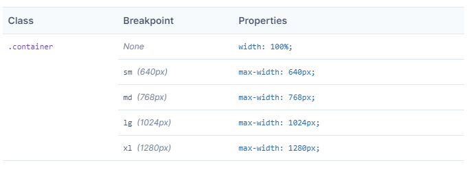

# Bienvenido a mis notas

## Video

https://www.youtube.com/watch?v=3xlUAMXui2c

https://bluuweb.github.io/tailwindcss/01-fundamentos/#vista-rapida

## CDN  
```html 
<script src="https://cdn.tailwindcss.com"></script>
```

## h1, h2 ,h3 . . .

Los encabezados tienen todos el mismo tamaño por defecto.

## Button

bg-blue-500: Background blue de  tonalidad 500

text-color

font-bold

py-2: Padding hacia arriba y abajo 2 (rem)

px-4 Padding hacia la derecha e izquierda 4

rounded: bordes redondeados

```html
<button class="bg-blue-500 hover:bg-blue-700 text-white font-bold py-2 px-4 rounded">Button</button>
```

## Media queries


**Si no especificamos el tamaño de pantalla siempre va a ser del tamaño mas chico al tamaño mas grande** por eso se ve del mismo tamaño.

Con sm especificamos para el tamaño mas pequeñito

```css
/* Small (sm) */
@media (min-width: 640px) { /* ... */ }

/* Medium (md) */
@media (min-width: 768px) { /* ... */ }

/* Large (lg) */
@media (min-width: 1024px) { /* ... */ }

/* Extra Large (xl) */
@media (min-width: 1280px) { /* ... */ }
```

```html
<button class="bg-blue-500 sm:bg-orange-400 hover:bg-blue-700 text-white font-bold py-2 px-4 rounded">Button</button>
```

bg-pantalla pequeñita

sm-pantalla small

el resto heredan de sm

Si nosotros no indicamos una pantalla superior se va a heredar el tamaño inferior.

El sm, md, lg, xl se puede colocar en cada cosa bg, py, px, rounded etc

```html
<button class="bg-blue-500 sm:bg-orange-400 hover:bg-blue-700 lg:bg-green-500 text-white font-bold py-2 px-4 rounded">Button</button>
```

Las clases ya vienen todas reseteadas por lo que no tendremos margin por defecto.

## Container

Container es sumamente útil para establecer un ancho prestablecido de nuestra página web

Con mx-auto centramos la página. mx es margin izq y der.


```html
<div class="container mx-auto">
        <button class="bg-blue-500 sm:bg-orange-400 hover:bg-blue-700 lg:bg-green-500 text-white font-bold py-2 px-4 rounded">Button</button>
    </div>
```
El container también tiene sus propios puntos de quiebre. No se necesita colocar las etiquetas. Con solo el CDN no se puede modificar el tamaño pero **podemos instalar tailwind con npm**



## Padding y Margin

Margin-top de 1.25rem

Se puede agregar hasta margenes negativos.

mt margin top
mb margin bottom
mr margin right
ml margin left
m margin (los 4)
mx izq der
my arriba abajo

```html
<div class="mt-5">
            <p>Lorem ipsum dolor sit amet consectetur, adipisicing elit. Deserunt, eveniet rem. Fuga, dolores consequuntur! Reprehenderit quidem nobis saepe? Iste cupiditate aliquid ab reiciendis velit alias exercitationem error sint veniam architecto?</p>
</div>
```

Agreguemos un borde

```html

    <div class="container mx-auto">

        <div class="mt-5 border">
            <p>Lorem ipsum dolor sit amet consectetur, adipisicing elit. Deserunt, eveniet rem. Fuga, dolores consequuntur! Reprehenderit quidem nobis saepe? Iste cupiditate aliquid ab reiciendis velit alias exercitationem error sint veniam architecto?</p>
        </div>
    </div>
```

Ahora no queremos que esté pegado por lo que agregamos un padding

```html

    <div class="container mx-auto">

        <div class="mt-5 p-5 border">
            <p>Lorem ipsum dolor sit amet consectetur, adipisicing elit. Deserunt, eveniet rem. Fuga, dolores consequuntur! Reprehenderit quidem nobis saepe? Iste cupiditate aliquid ab reiciendis velit alias exercitationem error sint veniam architecto?</p>
        </div>
    </div>
```

## Fuentes

Especificar siempre un texto de base. Y luego le agregamos los sm, md, lg...

Control the font size of an element using the text-{size} utilities.

**text-xs**	    font-size: 0.75rem; /* 12px */ line-height: 1rem; /* 16px */

**text-sm**	    font-size: 0.875rem; /* 14px */ line-height: 1.25rem; /* 20px */

**text-base**	font-size: 1rem; /* 16px */ line-height: 1.5rem; /* 24px */

**text-lg**	    font-size: 1.125rem; /* 18px */ line-height: 1.75rem; /* 28px */

**text-xl**	    font-size: 1.25rem; /* 20px */ line-height: 1.75rem; /* 28px */

**text-2xl**	font-size: 1.5rem; /* 24px */ line-height: 2rem; /* 32px */

**text-3xl**	font-size: 1.875rem; /* 30px */ line-height: 2.25rem; /* 36px */

**text-4xl**	font-size: 2.25rem; /* 36px */ line-height: 2.5rem; /* 40px */

**text-5xl**	font-size: 3rem; /* 48px */ line-height: 1;

**text-6xl**	font-size: 3.75rem; /* 60px */ line-height: 1;

**text-7xl**	font-size: 4.5rem; /* 72px */ line-height: 1;


**text-8xl**	font-size: 6rem; /* 96px */ line-height: 1;

**text-9xl**	font-size: 8rem; /* 128px */ line-height: 1;

Colores

```html
<h1 class="mt-5 text-green-500 text-5xl">Titulo</h1>
```

Align

```html
<h1 class="mt-5 text-green-500 text-5xl text-center">Titulo</h1>
```

Rounded mas o menos pronunciado con rounded-sm rounded-lg rounded-xl rounded-full

```html
<p class="bg-pink-500 rounded-lg">Tarjetita</p>
```

Tarjetita con ancho especifico!

w: width

```html
<p class="w-48 bg-pink-500 rounded-lg">Tarjetita</p>
```

Ancho de forma proporcional
```html
<p class="w-3/4 bg-pink-500 rounded-lg">Tarjetita</p>
```

## Box shadow

```html
<p class="shadow-xs">Box shadow</p>
<p class="shadow-sm">Box shadow</p>
<p class="shadow">Box shadow</p>
<p class="shadow-md">Box shadow</p>
<p class="shadow-lg">Box shadow</p>
<p class="shadow-xl">Box shadow</p>
<p class="shadow-2xl">Box shadow</p>
```

# FlexBox

## Flex direction

```html
<div class="flex">
            <div class="bg-orange-400 p-4 m-2">1</div>
            <div class="bg-orange-400 p-4 m-2">2</div>
            <div class="bg-orange-400 p-4 m-2">3</div>
        </div>
```

```html
<div class="flex flex-row-reverse">
            <div class="bg-orange-400 p-4 m-2">1</div>
            <div class="bg-orange-400 p-4 m-2">2</div>
            <div class="bg-orange-400 p-4 m-2">3</div>
        </div>
```

```html
<div class="flex flex-col">
            <div class="bg-orange-400 p-4 m-2">1</div>
            <div class="bg-orange-400 p-4 m-2">2</div>
            <div class="bg-orange-400 p-4 m-2">3</div>
        </div>
```

## Wrap

Por default está en nowrap

```html
<div class="flex flex-wrap">
            <div class="bg-orange-400 p-4 m-2">1</div>
            <div class="bg-orange-400 p-4 m-2">2</div>
            <div class="bg-orange-400 p-4 m-2">3</div>
        </div>
```

```html
<div class="flex flex-wrap-reverse">
            <div class="bg-orange-400 p-4 m-2">1</div>
            <div class="bg-orange-400 p-4 m-2">2</div>
            <div class="bg-orange-400 p-4 m-2">3</div>
        </div>
```

## Justify content

.justify-start por default

.justify-center

.justify-end

.justify-between

.justify-around

```html
<div class="flex justify-center">
            <div class="bg-orange-400 p-4 m-2">1</div>
            <div class="bg-orange-400 p-4 m-2">2</div>
            <div class="bg-orange-400 p-4 m-2">3</div>
</div>
```
```html
<div class="flex justify-end">
            <div class="bg-orange-400 p-4 m-2">1</div>
            <div class="bg-orange-400 p-4 m-2">2</div>
            <div class="bg-orange-400 p-4 m-2">3</div>
</div>
```
```html
<div class="flex justify-between">
            <div class="bg-orange-400 p-4 m-2">1</div>
            <div class="bg-orange-400 p-4 m-2">2</div>
            <div class="bg-orange-400 p-4 m-2">3</div>
</div>
```
```html
<div class="flex justify-around">
            <div class="bg-orange-400 p-4 m-2">1</div>
            <div class="bg-orange-400 p-4 m-2">2</div>
            <div class="bg-orange-400 p-4 m-2">3</div>
</div>
```

## Align items

Por default en stretch


```html
<div class="flex items-start">
            <div class="bg-orange-400 p-4 m-2">1</div>
            <div class="bg-orange-400 p-4 m-2">2</div>
            <div class="bg-orange-400 p-4 m-2">3</div>
</div>
```

```html
<div class="flex items-center">
            <div class="bg-orange-400 p-4 m-2">1</div>
            <div class="bg-orange-400 p-4 m-2">2</div>
            <div class="bg-orange-400 p-4 m-2">3</div>
</div>
```

## Align Content

Distribución de forma vertical (defecto)

```html
<div class="flex flex-wrap content-start">
            <div class="bg-orange-400 p-4 m-2">1</div>
            <div class="bg-orange-400 p-4 m-2">2</div>
            <div class="bg-orange-400 p-4 m-2">3</div>
</div>
```

## Align self

Debo agregar el items-start

```html
<div class="flex items-start">
            <div class="bg-orange-400 p-4 m-2 self-end">1</div>
            <div class="bg-orange-400 p-4 m-2">2</div>
            <div class="bg-orange-400 p-4 m-2">3</div>
</div>
```


